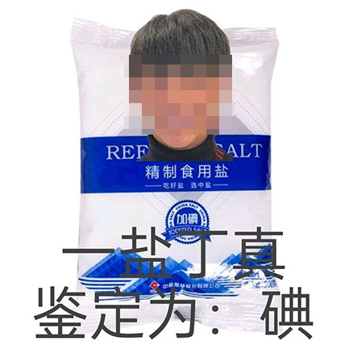

# The YYDZ (Yi Yan Ding Zhen / One Eye Ding Zhen) dataset

丁真宇宙，一眼丁真合集，目前已有两千多张图片。The majority of them are collected by 山风酱 on Baidu Tieba (贴吧id 436397865).

“一眼丁真”（pronounced as "Yi Yan Ding Zhen", literally "One Eye Ding Zhen"）is a very popular meme on Chinese social networks.

欢迎大家移除其中的重复图片，以及加入新图片。我提议下列任务：

赛道一：img2txt 图像转文本
* 任务1.1：输入图像，输出OCR文本
* 任务1.2：输入图像，输出谐音文本（例：春春的飞舞 -> 纯纯的废物）
* 任务1.3：输入图像，给图像分类，生成知识图谱（找到图像的相关梗和知识）
* 任务1.4：输入图像，鉴定为好活/烂活
* 任务1.5：输入擦除关键文本（涂黑）的图像，生成缺失的文本
* 任务1.6：输入图像，输出解释文本，计算 BLEU（需人工先标注）
* 任务1.A（高难度综合任务）：输入任何图像，合理地放置丁真和文本，尽可能生成合理的结果

赛道二：txt2img 文本转图像
* 任务2.1：inpainting
* 任务2.2：inpainting（已知文本的情况下）
* 任务2.3：输入文本，输出整幅图像
* 任务2.4：输入需要用到的梗和知识，输出整幅图像

## The evolution of the meme

Ding Zhen is this guy: https://en.wikipedia.org/wiki/Ding_Zhen.

"Yi Yan Zhen" ("One eye true") means something is true at first sight.

However it can also be sarcastic (on the Internet) and means something is fake at first sight.

The "Zhen" in Ding Zhen's name is exactly the same character.

Therefore people begin to use "Yi Yan Ding Zhen" ("One eye Ding Zhen") for extra sarcasm, because someone said "Ding Zhen has pure eyes", and pure is "Chun Zhen" in Chinese, with the same character "Zhen" too.

Now consider a YYDZ meme sample:


The Chinese reads:
```
One Salt Ding Zhen
Appraised as: Iodine
```

"One Salt" is "Yi1 Yan2" in Chinese, which sounds similar to "One Eye" (Yi1 Yan3). All these images are playing around with the "Yi1 Yan3" sound in the first part.

"Appraised as" is another meme.

"Iodine" is "Dian3" in Chinese, which sounds the same as "Classic" (Dian3), which is related to yet another meme ("Classically classic" = shitty).

So all these images are both puns and connecting various memes.

And hence they are funny to all who spent too much time on the Internet, and they become extremely popular.
